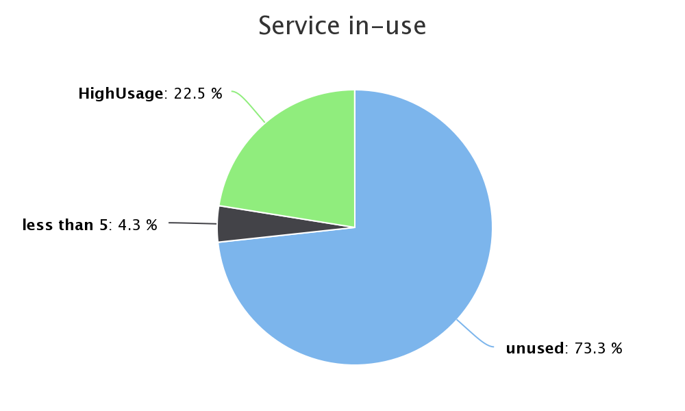

Valuereporter
=============

Valuereporter will show you which services your application actually are using, in production.
The Valuereporter-Agent will observe what classes, and methods are being used. This information
will be forwarded to this service, the Valuereporter.

Valuereporter will create statistics on usage, and present them in an intuitive GUI.

In the near future, Value reporter will also be able to:
- Show you which classes and methods that are NOT being used.
- Show you services that are offline.
- Show you the value generated by each of your services.

Example Output
===================

Show how much of your functionallity that are actually beeing used.



Installation
===================

* Copy Proprerties file
```
mkdir config_override
cp src/main/resources/valuereporter.properties config_override/
```
* Edit valuereporter.properties to suite your environment.

* Create database. Use sql resources\db\initialize_new_database.sql
** The updates to the database will be managed by Flyway


Running Valuereporter
===================

```
java -jar target/valuereporter-0.1-SNAPSHOT-with-deps.jar
```

Database
===================

Default behaviour of Valuereporter will use an embedded database.

The database setup in Valuereporter is utilizing Spring for configuration, and connection.
This will ensure you can connect Valuereporter to just about any database.
To use a permanent storage, see the Configuration section below.

Configuration
===================

See Installation, copy properties into config_override.

